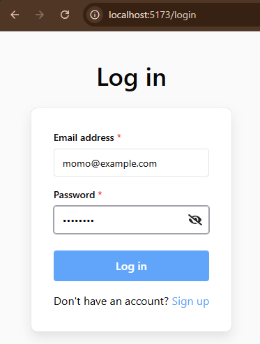
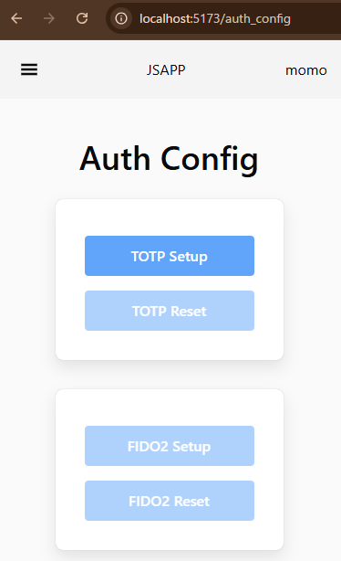
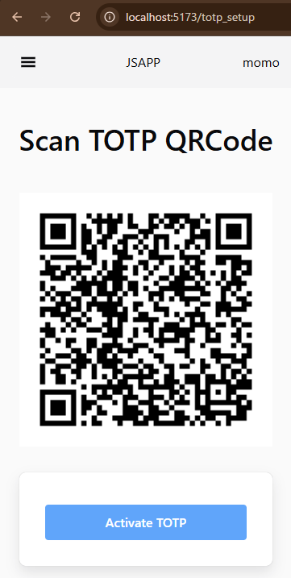
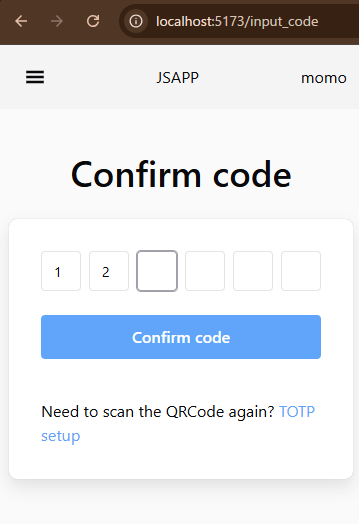
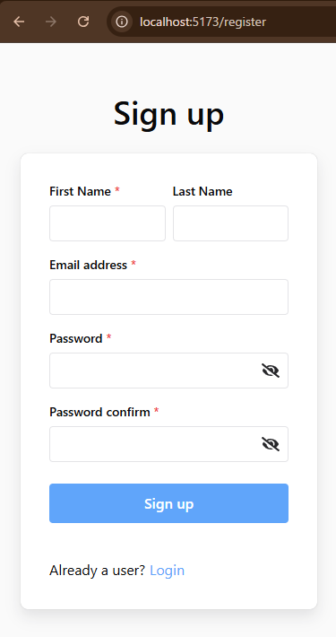

# jsapp

## 概要
パスワード、TOTP、FIDO2によるユーザー認証の実装<br>

## 使用言語、ライブラリ
## front


## api


## infra


## デモ
AWSで公開予定(準備中)

## 環境構築
```
$ cd jsapp
$ docker compose build
$ docker compose up -d
$ docker compose exec api bash
$ npx prisma migrate dev
$ npx prisma generate
$ npx prisma db seed
```

## 使用方法
http://localhost:5173/login で、<br>
①下記テスト用アカウントでパスワードログイン<br>
<br><br>

②メニューでAuth Configに画面遷移し、TOTP設定を行う<br>
<br><br>
<br><br>
<br><br>
<br><br>
③TOTP設定が完了したら、FIDO2認証設定が可能になっている<br>
<br><br>
④FIDO2設定後、アプリからログアウトすると<br>
パスワード＋TOTP、またはFIDO2認証が可能<br>

## テスト用アカウント
email: momo@example.com<br>
password: password<br>
<br>
新規アカウントを使う場合は、ログイン画面からリンク先の<br>
アカウント登録画面でアカウント登録を行う<br>
<br><br>

